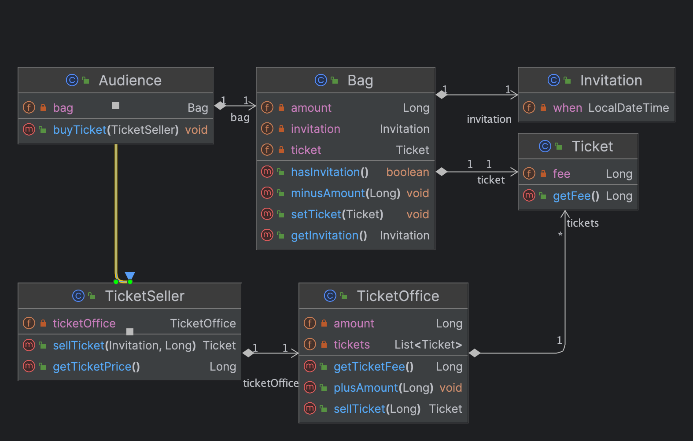

#### theater
`극장`에서 일어나는 상황이다.  
`방문자`는 `가방`에 `초대권`이 있을수도 있고 없을 수도 있다.  
`초대권`이 있다면 `티켓`으로 교환할 수 있고, `초대권`이 없다면 `티켓`을 돈으로 구매해야 한다.  
`티켓`을 관리하는 `판매원`이 있다.  
`판매원`은 `티켓오피스`에서 `티켓`을 관리한다.  
`티켓오피스`는 당연히 `극장`에 소속되어있다.  

코드를 작성할때에는 현실세계와 달리 모든 객체가 살아있다고 `의인화`하는게 좋다.  
예를 들어 `극장`은 건물일 뿐, 아무 역할도 없지만 코드에서는 스스로 `방문객`을 들여보내는 역할을 자율적으로 할 수도 있다.  
`티켓오피스`도 건물일 뿐이지만, `티켓`을 내어주면서 잔액을 관리하는 역할을 할 수도 있다.  
하지만 이에 매몰되어 역할부여에 너무 많은 고민을 할 필요는 없다.  
객체세계에서도 물리성은 있다. 가방이 의인화되어 역할을 할 수 있다는 것이지, 가방안에 초대권과 금액이 있는것은 동일하다.  

이렇게 생각해야 하는 이유는,  
실제 개발자가 보는 객체들은 전부 실제로 없는 `논리적` 존재가 훨씬 많기 때문이다.  
예를 들어 `Web, Packet` 등은 실제 세계에서 `물리적`으로 없는 존재이다.  
따라서, `물리적` 관계로 `객체`들의 관계를 생각하지 말고 각 `객체`의 `역할`과 `메시지`의 흐름으로 `객체`간의 `참조관계`를 설정해가야 한다.

먼저, 객체의 `행동`을 결정해보자.  
어떤 `행동`을 하는지 생각해보면서 행동을 기반으로 어떤 필드를 가지고 있는게 좋을지 판단하고 객체에 필드를 부여한다.

쉬운 경우부터 연습해보자.  
`방문객`은 자신이 보유한 `가방`에게 `초대권`이 있는지 여부를 물어봐야 한다.  
혹은 `티켓` 구매를 위해 `가방`에게 `티켓금액`만큼 `돈`을 요구해야 한다.  
이러한 관계를 생각했을 떄 `방문객`은 `가방`을 참조하고 있고,  
`가방`은 `초대권`과 `금액`을 필드로 가지고 있는게 좋을 것 같다.   
`초대권`은 예를 들어 `공연시간` 등 정보성 필드만 가지고 있으면 충분할 것 같다.  
이렇게 `방문객`, `가방`, `초대권`의 `역할`과 `메시지`의 흐름을 정했다.  

다른 객체도 정해보자.  
실제세계에서는 `티켓오피스`는 건물일 뿐 모든 일은 `티켓판매원`이 할테지만,  
객체세계에서는 `티켓오피스`도 자신의 역할이 있다.
`티켓판매원`은 `방문객`과 대화하여 `초대권`을 `티켓`으로 교환해주거나, `초대권`이 없다면 `티켓`을 판매한다.  
그럼 `티켓`은 어떻게 교환해주는가?  
객체세계에서는 `티켓판매원`이 `티켓`을 관리하는 `티켓오피스`에게 티켓을 달라고 한다.  
`티켓판매원`은 올바른 `금액`을 받았는지, `시간`에 맞는 올바른 `초대권`이 맞는지 등을 판단하면 될 것 같다.  

하나 남은 객체인 `극장`이 있다.  
`방문객`과 `티켓판매원`이 열심히 대화하여 `방문객`은 `티켓`을 얻을 것이다.  
그리고 `방문객`과 `극장`의 대화가 시작될 것이다.  
`극장`은 `방문객`의 `티켓`보유여부를 확인하고 `관람객`을 입장시키는 역할을 하면 될 것이다.  

객체세계의 코드를 작성해보자.

#### v1
`getter, setter`를 먼저 작성하는 습관을 버리고, 위의 설계에 따라 시작해보자.  
`티켓, 초대권, 가방, 방문객`은 아래와 같을 것이다.

~~~java
public class Ticket {
	private Long fee;

	public Ticket(Long fee) {
		this.fee = fee;
	}
}
~~~
~~~java
public class Invitation {
	private LocalDateTime when;

	public Invitation(LocalDateTime when) {
		this.when = when;
	}
}
~~~
~~~java
public class Bag {
	private Long amount;
	private Invitation invitation;
	private Ticket ticket;

	public Bag(Long amount) {
		this.amount = amount;
	}

	public Bag(Long amount, Invitation invitation) {
		this.amount = amount;
		this.invitation = invitation;
	}
}
~~~
~~~java
public class Audience {
	private Bag bag;

	public Audience(Bag bag) {
		this.bag = bag;
	}
}
~~~

이제 `메시지`를 추가해보자.  
어떤 `메시지`를 가장 먼저 추가할까?  
`방문객`이 `가방`에게 `티켓금액`을 확인해달라고 하거나,   
`초대권`이 있는지 여부를 확인해달라고 하는 행동은 `티켓판매원`과 대화를 할 때이다.  
그리고 대화는 `방문객`이 `티켓판매원`에게 말을 걸면서 시작한다.  

내가 가장먼저 추가할 메시지는 아래와 같다.  

~~~java
public class Audience {
    ...
	
	public Ticket buyTicket(TicketSeller ticketSeller) {
		...
	}
}
~~~

이제 `buyTicket()`의 동작을 생각해보자.    

~~~
1. 가방에게 초대권이 있는지 확인
2. 초대권이 있다면 초대권을 티켓판매원에게 전달
3. 초대권이 없다면 금액을 티켓판매원에게 전달
~~~

`티켓판매원`에게는 `초대권`과 `금액`을 전달하는 `메시지`가 필요하다. 이를 추가하자.  
~~~java
public class TicketSeller {
    ...
    
	public Ticket sellTicket(Invitation invitation, Long amount) {
		...
	}
}
~~~

`방문객` 입장에서 `sellTicket()` `메시지`만 알면 된다. 세부로직은 알 필요가 없다.  
`buyTicket()`를 완성해보자.  

~~~java
public Ticket buyTicket(TicketSeller ticketSeller) {
    ticketSeller.sellTicket(bag.getInvitation(), bag.getAmount());

    ...
}
~~~

코드의 첫 줄을 쓰고부터 문제가 생겼다.  
일단 `가방`에서 `getter`를 두 번 호출하는 것부터 찝찝하다.  
무엇보다, `티켓판매원`에게 내가 `1억`이 있으면 `1억`을 전달해야하는 부분이 문제이다.  
`티켓판매원`에게 `티켓금액`을 물어보고 필요금액만큼만 전달해야한다.  
그리고 `가방`에 `티켓금액`만큼만 차감할 수 있도록 하는 행동이 필요하고,  
`티켓`을 받으면 `티켓`을 보유할 수 있도록 `가방`에 `티켓`필드도 추가해야겠다.

~~~java
public class TicketSeller {
	private TicketOffice ticketOffice;
	
    ...

	public Long getTicketPrice() {
		return ticketOffice.getTicketFee();
	}
}
~~~

~~~java
public class TicketOffice {
	private Long amount;
	private List<Ticket> tickets = new ArrayList<>();

    ...
    
	public Long getTicketFee() {
		return tickets.get(0).getFee();
	}
}
~~~

`티켓판매원`은 `티켓오피스`에 `티켓가격`을 물어봐야하고, `티켓오피스`는 `티켓`으로부터 `금액`을 가져와야 한다.  
이를 위해 위와같이 메서드를 추가하였다.

`가방`에는 여러개의 메서드가 추가되었다.
~~~java
public class Bag {
    ...
    
	public void minusAmount(Long amount) {
		this.amount -= amount;
	}

	public boolean hasInvitation() {
		return this.invitation != null;
	}

	public void setTicket(Ticket ticket) {
		this.ticket = ticket;
	}

	public Invitation getInvitation() {
		return invitation;
	}
}
~~~

이제 다시 `buyTicket()`을 완성해보자.

~~~java
public void buyTicket(TicketSeller ticketSeller) {
    if (bag.hasInvitation()) {
        Ticket ticket = ticketSeller.sellTicket(bag.getInvitation(), null);
        bag.setTicket(ticket);
        return;
    }

    Long ticketPrice = ticketSeller.getTicketPrice();
    bag.minusAmount(ticketPrice);
    Ticket ticket = ticketSeller.sellTicket(null, ticketPrice);
    bag.setTicket(ticket);
}
~~~

티켓판매원의 `sellTicket()`도 완성해보자.

~~~java
public Ticket sellTicket(Invitation invitation, Long amount) {
    return ticketOffice.sellTicket(amount);
}
~~~

`티켓오피스`의 `sellTicket()`은 간단할 것이다.

~~~java
public class TicketOffice {
    ...
    
	public void plusAmount(Long amount) {
		this.amount += amount;
	}

	public Ticket sellTicket(Long amount) {
		plusAmount(amount);
		return tickets.remove(0);
	}
}
~~~

완성된 클래스다이어그램은 아래와 같다.

