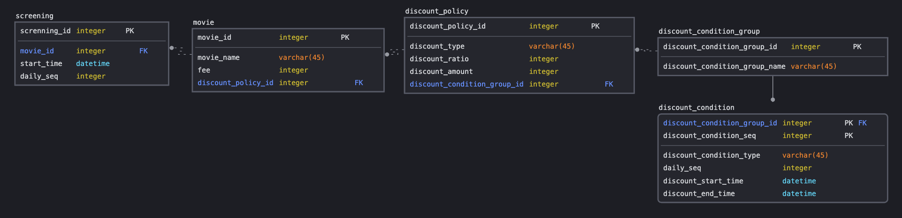

#### reservation
영화예매 시스템 개발의뢰가 들어왔다. 요구조건부터 살펴보자.  

`영화`는 `할인`을 할 수 있다.  
`할인의 조건`은 두가지이다.  
첫 번째는 영화의 `상영순서에 따른 할인`이다.  
예를 들어 하루 중 첫 번째와 마지막으로 상영되는 영화는 할인을 적용할 수 있어야 한다.  
두 번째는 영화의 `요일과 시간에 따른 할인`이다.  
예를 들어 매주 화요일 오전 10시부터 오후 2시까지 `상영시작`되는 영화는 할인을 적용할 수 있어야 한다.  

`할인의 종류`는 두가지이다.  
특정금액을 할인해주는 `정액할인`과 특정비율로 할인해주는 `정률할인`이 있다.  

한 영화에는 정액, 정률할인 중 `하나의 할인`만 적용할 수 있다.  

#### erd
위의 요구사항의 erd는 아래와 같다.

#### 협력, 역할, 책임
가장 먼저 생각해야 할 것은 `협력`이다.  
어떤 객체가 필요한 지, 어떤 역할을 부여할 지는 `협력`이 결정된 뒤에 생각해볼 수 있는 문제이다.  
객체들은 `영화예매`를 위해 `협력`해야 한다.  
모든 `역할`과 `책임`은 `영화예매`라는 `목적`을 기준으로 각 `객체`에 할당할 것이다.  

#### v1
시작은 `영화 예매하기`라는 기능으로부터 시작할 수 있을 것 같다.  
그리고 이 기능은 `영화예매`를 가장 잘 할 수 있는 `객체`에게 `책임`을 부여해야 한다.  
영화예매를 가장 잘 할수 있는 객체는 `영화예매에 대한 정보`를 가장 잘 알고 있는 객체이다.  

어떤 객체가 `영화예매`에 대한 정보를 가장 잘 알고 있을까?  
고객은 `영화상영표`를 보고 예매를 결정한다.  
`영화상영표`에는 `영화`와 `상영시간`정보를 포함하고 있다.  
두 가지를 알고 있는 `객체`가 있다면 해당 객체에게 `영화예매 책임`을 부여하는게 좋을 것 같다.  

`영화`와 `상영시간정보`를 알고 있는 `상영`이라는 객체를 만들어보자.  
`영화`는 간단하게 영화의 `이름`정도만 보관하자.  
`상영시간정보`에는 `순서할인조건`에 필요한 `상영순서`와 `시간할인조건`에 필요한 영화의 `시작시간`, `종료시간`을 포함하고 있을 것이다.   

~~~java
public class Movie {
	private String name;
}

public class Screening {
	private Movie movie;
	private int sequence;
	private LocalDateTime startTime;
	private LocalDateTime endTime;
}
~~~

이제 `상영`객채에 `예매하기`라는 `메시지`를 만들어야 한다.  
인터페이스는 어떻게 될까?  
`예매`를 했으면 `예매객체`를 리턴하는게 좋을 것 같다.  
간단하게 `예매`객체를 만들자.

~~~java
public class Reservation {
	private Screening screening;
	private long fee;
	private int count;

	public long getTotalFee() {
		return fee * count;
	}
}
~~~

이제 `상영`에 `예매하기 협력시스템`의 역사적인 첫 `메시지`를 만들자.  

~~~java
public Reservation reserve(int count);
~~~

`예매`를 리턴하려면 결국 `최종 할인금액`을 알아야한다.  
`상영`이 가진 정보만으로는 `할인`을 계산할 수 없다.  
`할인전문가`에게 `할인에 대한 책임`을 맡겨야 할 것 같다.  
할인은 정액, 정률할인이 있다고 했다.  
만약 상영단위로 정액, 정률할인이 하나씩만 부여된다고 했다면 상영이 할인정보를 알아야한다.  
하지만, 놀랍게도 이 시스템은 `영화가 하나의 할인정책`을 가지고 있다.   
어떤 시간에 상영하느냐에 관계없이 같은 영화라면 정액, 정률중 하나만 적용된다. `(공부를 위한 설계이다.)`  
따라서, `할인정책`은 `영화의 필드`로 들어가게 된다. `영화금액`도 `상영`이 아닌 `영화의 필드`로 들어가게 된다.

자연스럽게 `할인금액 계산하기`라는 `역할`은 `할인정보 전문가`인 `영화`에게 할당된다.  
여기서 중요한 것은 `상영`은 `영화`에게 `할인금액을 계산하라`고 요청할뿐, 정액, 정률여부는 중요하지 않다는 것이다.  
`영화`에게 `상영정보`를 넘겨주면서 `할인금액을 요청`하고 `금액을 받으면` 그 뿐이다.   

우리 시스템의 역사적인 두번째 `메시지`를 영화에 만들어주자.

~~~java
public long calculateFee(Screening screening);
~~~
